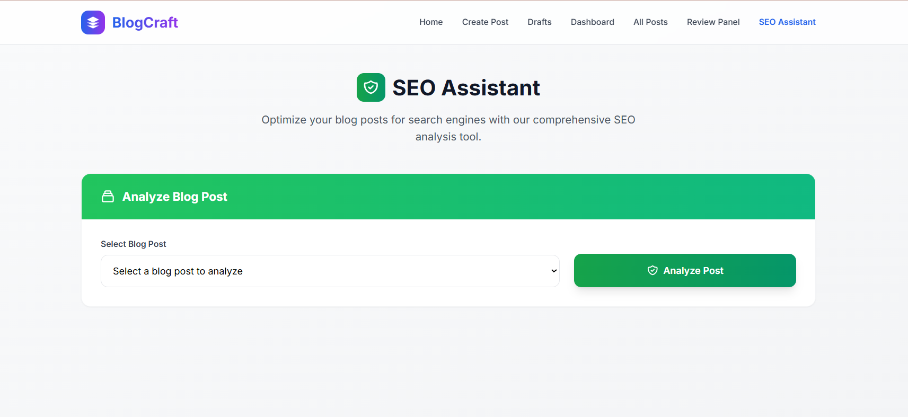
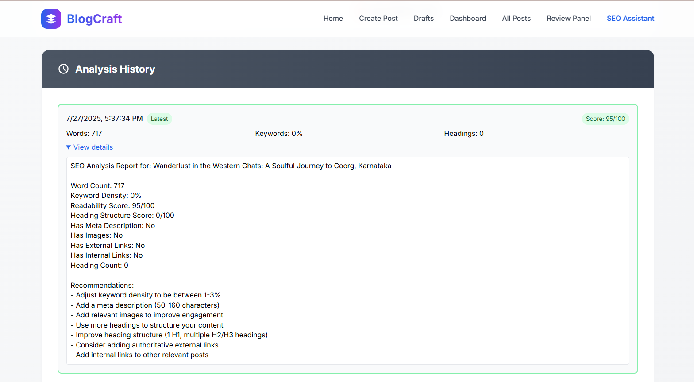

# 🔍 SEO Assistant Module (BlogCraft)

This module enhances content discoverability by providing SEO optimization tools within BlogCraft. Built with Spring Boot and JavaScript, it analyzes drafts, suggests improvements, and tracks keyword performance to maximize organic reach.

## 🌟 SEO Features

### 🔧 Content Optimization Tools
- **SEO Score** – Rates draft quality based on readability, keyword density, and metadata.
- **Keyword Suggestions** – Recommends high-traffic keywords related to the topic.
- **Meta Tag Generator** – Auto-generates optimized meta titles/descriptions.
- **Fix Recommendations** – Highlights issues like broken links or missing alt text.

## 🛠️ Technologies Used
**Backend:** Java, Spring Boot (REST APIs)  
**Frontend:** JavaScript, Tailwind CSS, Chart.js (for analytics)  
**Database:** MySQL (stores SEO metrics and historical data)  

## 💡 How It Works
1. **Analyze Drafts:** Users submit content for SEO scoring.
2. **Get Recommendations:** The module suggests fixes (e.g., "Add more headings" or "Use keywords in the first paragraph").
3. **Track Performance:** Historical data visualizes keyword rankings over time.

## 📸 Screenshots
1. **SEO Dashboard**
   Overview of SEO scores and key metrics for all blog posts 
     
   

3. **SEO Analysis**
   Detailed analysis of a specific post with improvement suggestions 
     
   

5. **SEO Analysis History**
   Historical tracking of SEO performance over time  
     
   

## 👥 Authors
1. Pratiksha Kulkarni
2. Rajnish Kewat
3. Ram Ingale
